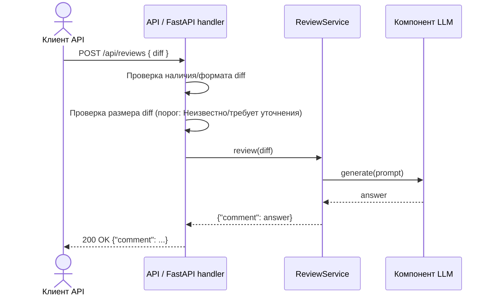

# Use cases и user stories

## Первый рабочий сценарий

**Когда** клиент API отправляет POST `/api/reviews` с корректным `diff` разумного размера, **система** валидирует вход (наличие/формат `diff`), проверяет, что размер `diff` не превышает допустимый порог (порог — Неизвестно / требует уточнения), формирует промпт и вызывает компонент LLM через интерфейс `LLM.generate`, **а пользователь получает** ответ `{"comment": <строка>}`.

Не входит в этот сценарий:

- Аутентификация/авторизация (Неизвестно / требует уточнения)
- Конкретные коды и тексты ошибок (Неизвестно / требует уточнения)
- Точный порог размера `diff` (Неизвестно / требует уточнения)

## Use case

| Поле | Значение |
|---|---|
| Актор | Клиент API |
| Триггер | HTTP POST `/api/reviews` с JSON, содержащим поле `diff` |
| Предусловия | API доступен; формат JSON корректен |
| Основной результат | HTTP 200 и тело `{"comment": <строка>}` |
| Ошибка или отказ | Контролируемый 4xx при отсутствии/некорректном `diff` или превышении допустимого размера; контролируемый 5xx при ошибке LLM |



## User stories и acceptance criteria

User stories:

- Как клиент API, я хочу получить результат ревью для корректного diff, чтобы использовать его в своём процессе принятия решений.
- Как клиент API, я хочу получить контролируемую ошибку при отсутствии или некорректном поле diff, чтобы исправить запрос без сбоев сервера.
- Как клиент API, я хочу получить контролируемое поведение при слишком большом diff, чтобы понимать ограничение и уменьшить размер запроса.
- Как клиент API, я хочу получить контролируемый ответ при ошибке LLM, чтобы повторить попытку позже или предпринять альтернативные действия.

```gherkin
Feature: Ревью diff через API

  Scenario: Успешный запрос с корректным diff
    Given корректный JSON с полем diff разумного размера
    When клиент отправляет POST /api/reviews
    Then сервер отвечает 200 OK
    And тело ответа — JSON с ключом comment (строка)

  Scenario: Отсутствующий или некорректный diff
    Given JSON без поля diff или с diff некорректного типа
    When клиент отправляет POST /api/reviews
    Then сервер отвечает 4xx (клиентская ошибка)
    And тело ответа содержит объяснение причины (Неизвестно / требует уточнения формулировки)

  Scenario: Слишком большой diff
    Given JSON с diff, превышающим допустимый размер (порог — Неизвестно / требует уточнения)
    When клиент отправляет POST /api/reviews
    Then сервер отвечает 4xx (слишком большой запрос)
    And тело ответа не содержит стека исключений

  Scenario: Ошибка LLM
    Given корректный JSON с diff разумного размера
    And компонент LLM генерирует исключение при обработке запроса
    When клиент отправляет POST /api/reviews
    Then сервер отвечает контролируемым 5xx
    And тело ответа без трассировки стека и с понятным описанием ошибки (Неизвестно / требует уточнения формат)
```

## Как использовали AI

- Для чего: Сформулировать use cases, user stories и сценарии на основе problem.md и TO BE из analysis.md.
- Тип промпта: Инструкция текущего запуска (P1-04).
- Строка в [`prompts.md`](prompts.md): P1-04.
- Что проверили и исправили сами: Связь user stories с проблемой и TO BE; проверяемость acceptance criteria; отсутствие выдуманных пользователей и значений.
