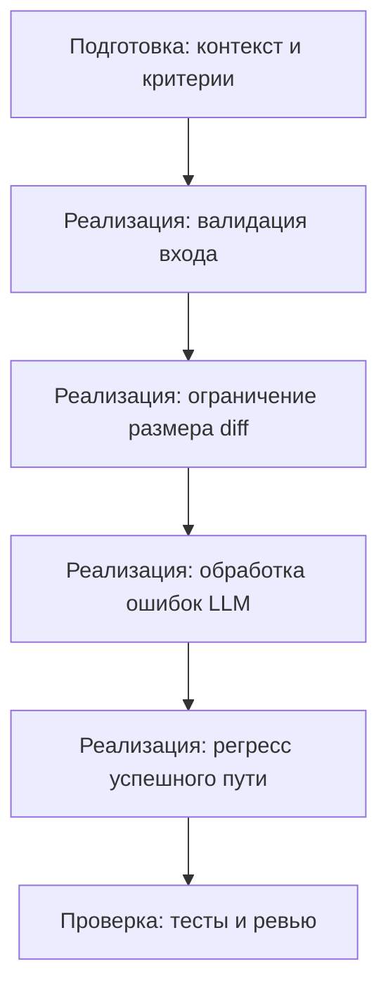

# План поставки

## Инкременты и ответственность

| Инкремент | Наблюдаемый результат | Что делает человек | Что делает AI или субагент | Проверка | Зависимости |
|---|---|---|---|---|---|
| 1. Валидация входа `diff` | Некорректные запросы (без `diff`/неверный тип) получают контролируемый 4xx | Уточняет требования к валидации; утверждает формат ошибки | Предлагает схему валидации, черновик тест-кейсов | План проверки: отправка запросов без `diff`/с неверным типом должна приводить к 4xx | Анализ AS IS |
| 2. Ограничение размера `diff` | Слишком большие `diff` отклоняются контролируемым 4xx | Утверждает порог (Неизвестно / требует уточнения) и тексты ошибок | Предлагает подход к измерению размера и тест-кейсы | План проверки: отправка сверхпорогового `diff` приводит к 4xx | Инкремент 1 |
| 3. Обработка ошибок LLM | Исключения LLM трансформируются в контролируемый 5xx | Утверждает формат и семантику ответа при ошибке | Предлагает обработку исключений и негативные тесты | План проверки: симуляция исключения LLM приводит к предсказуемому 5xx | Инкременты 1–2 |
| 4. Регресс успешного пути | Валидный запрос возвращает 200 и `{ "comment": answer }` | Проверяет, что успешный путь не затронут | Генерирует черновики позитивных тестов | План проверки: валидный `diff` — 200 OK и ожидаемый формат ответа | Инкременты 1–3 |

## Порядок работ

## Как использовали AI

- Для чего: Разбить переход AS IS → TO BE на проверяемые инкременты с разделением ролей.
- Тип промпта: Инструкция текущего запуска (P1-04).
- Строка в [`prompts.md`](prompts.md): P1-04.
- Что проверили и исправили сами: Связь инкрементов с problem.md и TO BE; отсутствие выдуманных сроков и показателей; корректная роль Human/AI.
